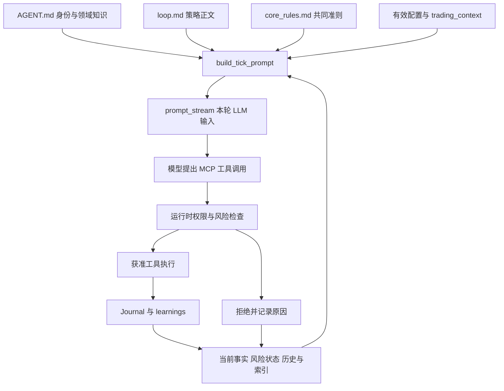

# Condor 的交易策略与准则如何进入 LLM

源码导读日期：2026-10-06，Asia/Shanghai。
依据本机 `D:/develop/tradingagent/condor-main`，仅阅读源码与内置示例；没有启动 Condor、连接账户或调用模型。
本文中的交易数字是仓库里的策略设定，用于解释软件行为。

## 1. 总体机制

Condor 把策略写成 Markdown，把参数写成 YAML；运行时解析后拼成每轮 tick 的上下文。
模型读取身份、策略步骤、会话要求、当前参数、风险与历史，然后通过 MCP 工具取数据或执行动作。
这些内容是推理时的上下文，不是对 LLM 的训练或微调。



核心代码：[build_tick_prompt](D:/develop/tradingagent/condor-main/condor/agents/prompts.py:428)、
[TickEngine 采集阶段](D:/develop/tradingagent/condor-main/condor/agents/engine.py:597)。

## 2. 各类设定放在哪里

| 类型 | 来源 | 注入方式 |
| --- | --- | --- |
| Agent 身份、知识与长期操作方法 | `D:/develop/tradingagent/condor-main/agents/<agent>/AGENT.md` 的 Markdown 正文 | 解析为 Agent.instructions，全文进入 `[AGENT — domain identity & knowledge]` |
| 本策略的目标、步骤、筛选条件、退出与恢复流程 | `D:/develop/tradingagent/condor-main/agents/<agent>/loops/<loop>/loop.md` 的正文 | 解析为 Strategy.instructions，全文进入 `[LOOP INSTRUCTIONS]` |
| 公共行为准则 | Agent 自己的 core_rules.md，否则 `_defaults/core_rules.md`；本机修改层优先于内置层 | 进入 `[CORE RULES — apply to every session]`，在身份和策略之前 |
| 当前数值配置 | loop.md 的 default_config，叠加本机 config.yml、启动请求，并补核心默认值 | 进入 `[CURRENT CONFIG]`；明确告诉模型当前配置覆盖策略正文提到的默认值 |
| 本次会话的临时要求 | 有效配置中的 trading_context | 进入 `[SESSION CONTEXT]`，指引市场选择、风险偏好与风格 |
| 领域技能和可执行流程 | SkillStore 与 routines 发现 | 先注入名称/触发条件/流程索引，具体 Skill 正文通过 manage_skill(read) 按需读取 |
| 当前账户/执行事实与风险 | providers、RiskEngine | `[CORE DATA - ...]` 和 `[RISK STATE]`；行情可能由模型再调用工具获取，并非所有原始行情自动塞进 Prompt |
| 运行经验与近期决策 | JournalManager | learnings、当前状态、最近三条决策、canvas、loop 状态与上一轮拒绝原因 |

Agent 正文解析见 [agent.py](D:/develop/tradingagent/condor-main/condor/agents/agent.py:234)，
策略正文解析见 [strategy.py](D:/develop/tradingagent/condor-main/condor/agents/strategy.py:145)，
配置合并见 [config.py](D:/develop/tradingagent/condor-main/condor/agents/config.py:140)。
Web 启动先读取有效配置并叠加请求，再设置 trading_context；请求未提供且已有配置也未设置时，使用策略的 default_trading_context。
见 [Web 启动装配](D:/develop/tradingagent/condor-main/condor/web/routes/agents.py:3074)。

core_rules 使用第一个可读、正文非空的文件，而非把所有版本追加合并；Agent 专属规则会替代默认规则。
见 [load_core_rules](D:/develop/tradingagent/condor-main/condor/agents/prompts.py:400) 与
[层叠文件解析](D:/develop/tradingagent/condor-main/condor/memory/paths.py:208)。

## 3. 真正拼接的内容与消息位置

Prompt 主要顺序为：执行模式基础规则 → 日志协议 → 通用规则 → core_rules → 无人值守授权说明（live 模式）
→ 工具说明 → tick 身份 → Agent 身份 → loop 正文 → skills/routines/controllers 索引
→ session context → current config → controller mode（若适用）→ risk state
→ 上轮拒绝/loop 状态 → core data → user memory 索引 → learnings → 当前状态 → 最近决策 → canvas。
没有数据的可选段落会省略。

以下是源码关键拼接形式；不是一份实际调用过模型的抓包：

```python
sections.append(f"[AGENT — domain identity & knowledge]\n{agent.instructions}")
sections.append(f"[LOOP INSTRUCTIONS]\n{strategy.instructions}")
# 后续追加会话上下文、有效参数、风险、事实和历史
return "\n\n".join(sections)
```

对应 [prompts.py:535](D:/develop/tradingagent/condor-main/condor/agents/prompts.py:535)。

**消息层级要按调用代码判断，不能只看变量名。**
交易 TickEngine 的 build_gated_client 没传 system_prompt，整份 tick Prompt 最终传入
`client.prompt_stream(prompt)`；ACP 发送 session/prompt 文本块，PydanticAI 传给 Agent.iter 的 user prompt。
快照保存参数叫 system_prompt，但这个名称不意味着它真的作为 API system 消息发送。

- [tick 输入位置](D:/develop/tradingagent/condor-main/condor/agents/engine.py:1265)
- [tick 客户端装配](D:/develop/tradingagent/condor-main/condor/agents/engine.py:1528)
- [ACP 本轮请求](D:/develop/tradingagent/condor-main/condor/acp/client.py:1106)
- [PydanticAI 本轮输入](D:/develop/tradingagent/condor-main/condor/acp/pydantic_ai_client.py:1062)

另一条通道是 Condor MCP 服务器的 instructions：它包含身份框架、core_rules 和索引。
PydanticAI 使用 include_instructions=True 读取这些服务器说明，见
[MCP 说明组装](D:/develop/tradingagent/condor-main/mcp_servers/condor/server.py:249) 与
[MCP 客户端选项](D:/develop/tradingagent/condor-main/condor/acp/pydantic_ai_client.py:712)。
聊天绑定专家时还会显式传 system_prompt 身份头，见
[聊天创建客户端](D:/develop/tradingagent/condor-main/condor/runtime/sessions.py:756)。
这条聊天路径不能套用到 tick，声称所有策略正文都在 system 层。

每个 tick 新建客户端，重新拼上下文；历史通过 journal/learnings 等重新提供。
core_rules、skills/routines 索引、用户记忆与日志会重新读取。
Agent/Strategy 正文使用已经装入 engine 的对象；不能据此推断运行中编辑所有策略文件都会自动热更新。

## 4. 看一个实际策略：EMA Trend Loop

首先读 [Directional Trader 身份](D:/develop/tradingagent/condor-main/agents/directional_trader/AGENT.md:18)，
再读 [EMA loop](D:/develop/tradingagent/condor-main/agents/directional_trader/loops/ema_trend_loop/loop.md:17)。

AGENT.md 描述趋势/均值回归、指标与控制器知识，要求先确认信号规格、再开发控制器、回测和部署。
loop.md 将具体的一轮工作写成流程：发现 EMA 配置 → 回测候选 → 排序筛选 → 检查/部署 bot
→ 检查持仓 → 检查总回撤 → 写日志 → 通知。

这份 loop 的初筛条件是 Sharpe > 1、最大回撤 < 15%、胜率 > 45%、14 天 PnL 为正；
没有候选满足时，正文允许将 Sharpe 阈值降到 0.5，再次失败则不部署。
这些条件由 LLM 按 `[LOOP INSTRUCTIONS]` 理解和运用，Prompt builder 并没有把它们编译成确定性筛选函数。

也存在真正的数值策略代码：例如
[MACD + Bollinger 控制器](D:/develop/tradingagent/condor-main/agents/directional_trader/controllers/macd_bb_v1/macd_bb_v1.py:69)
用 pandas 指标与布尔条件生成 +1/-1/0 信号。
因此 Condor 中的“策略”同时包含 LLM 的操作流程和控制器的确定性交易算法，不能混为一层。
上述 EMA loop 默认针对 binance_perpetual，也不同于本项目的 BTCUSDT 现货只读范围。

## 5. 文字准则与硬限制怎样配合

交易 tick 创建时，`config['risk_limits']` 被构造成 RiskLimits 和 RiskEngine；
采集阶段可以在模型运行前阻断 tick 或触发紧急收尾。
模型提出工具调用后，auto_approve_with_risk_check 再检查模式、参数、敞口、执行器数量、杠杆、所有权等。
工具能力还受挂载 profile/allowlist 约束；这些与 Prompt 文本独立。

代码位置：[风险实例化](D:/develop/tradingagent/condor-main/condor/agents/engine.py:277)、
[RiskEngine](D:/develop/tradingagent/condor-main/condor/agents/risk.py:265)、
[工具权限回调](D:/develop/tradingagent/condor-main/condor/agents/risk.py:782)。
PydanticAI 的 [PermissionGatedToolset](D:/develop/tradingagent/condor-main/condor/acp/pydantic_ai_client.py:332)
把拒绝落实到实际执行前；不能把文字“必须遵守”当作同样的强制门控。

一个可核对的例子：内置
[BTC-USDT Adaptive Grid](D:/develop/tradingagent/condor-main/agents/adaptive_grid_trader/loops/btc_usdt_adaptive_grid/loop.md:27)
正文写 max_leverage: 5x，但该文件的 default_config.risk_limits 只设置敞口和执行器数。
若有效会话配置没有另设 max_leverage，RiskLimits 的默认值是 -1，即此项检查关闭。
所以“正文写 5x”并不自动等于“运行时强制 5x”；以实际有效配置为准。
默认值见 [RiskLimitsConfig](D:/develop/tradingagent/condor-main/condor/agents/config.py:48)，
启用与检查逻辑见 [杠杆门控](D:/develop/tradingagent/condor-main/condor/agents/risk.py:328)。

被拒绝的调用会记录原因，并进入下一轮 `[REFUSED LAST TICK]`，帮助模型改变动作。
交易经验通过 Journal 的 learning 写入，再于后续 tick 读取；这是外部文本记忆改变上下文，不是自动修改模型权重。
见 [日志协议](D:/develop/tradingagent/condor-main/condor/agents/prompts.py:179) 和
[经验读取](D:/develop/tradingagent/condor-main/condor/agents/journal.py:474)。

对本项目的对应理解：身份、策略与风格可以进入评估上下文；个人资金纪律需要同时进入确定性风险内核。
当前项目尚未迁移 Condor 的 AGENT.md/loop.md/SkillStore 加载体系，本次仅做源码导读，没有改变产品行为。
