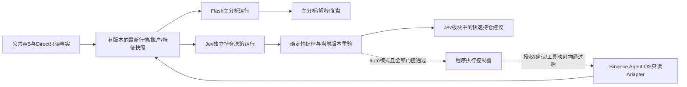

# Jev独立持仓决策模块

**最新产品规格已迁移到JEV_PARALLEL_PRODUCT.md。** 用户明确两个主页面：大盘/Flash＋可选Jev建议、独立Jev操盘。JevAdvice和JevTrader分别开关，不互相绑定。下文记录最初两模式方案的历史推导；其中“关闭Jev建议暂停操盘”已废止，不作为当前实现要求。

修订：2026-10-06。用户最新要求覆盖前一版默认Flash→Jev串行级联：Jev应是单独板块，可开启/关闭，持仓时独立快速判断；关闭时Flash保留主分析路径；Jev相关程序连接Binance Agent OS。强模型继续仅选择、不调用。

## 决策与数据流

- Flash与Jev不互相await；Jev请求不依赖本轮Flash输出。输入来自当时有效的原始快照与明确配置的策略标准。允许使用已提前确认并版本化的策略配置，不能把临时Flash文字当作交易权限。
- Jev的Choice可以描述HOLD/REDUCE/EXIT/ADD/ABSTAIN等持仓判断，但这些只是设计中的候选空间；具体标准和是否允许ADD须用户策略配置/评测后启用。Jev不自由生成数量、价格或工具名；代码生成有限候选与参数，硬纪律决定合法性。
- Jev关闭时不发起Jev请求、不预留新模型费用；Flash分析和行情采集继续运行。关闭后重新开启不得恢复上一启用版本的在途行动资格；已经派发的请求仍完成费用记录。
- Jev独立于Flash不代表独立于资金纪律。两条路径共用明确的账户scope、风格版本、策略版本、风险限制、持久费用账本及全局60次/小时额度。
- 原来的串行语义复核只作为未来可选研究模式，不是默认实时持仓路径；当前版本不实现循环复核或强模型自动升级。

## 速度要求

串行路径的延迟包含Flash与Jev两次等待；独立路径只等待Jev及本次代码处理。两者还分别受网络、provider、预算锁和数据质量影响，因此不能在真实样本前承诺固定亚秒延迟。

数据消费者持续更新本地缓存；不能每次Jev判断都先让Flash总结，或临时串行执行一组MCP账户查询。MCP/Direct先通过只读Adapter正规化、记录账户范围和时效；当前快照不足/过期时拒绝判断，不拿旧数据换速度。持仓变化、已定义价格事件和人工请求触发Jev，单在途+去抖+最新触发合并；Flash有自己的触发器与工作任务。

延迟分开记录trigger→snapshot、snapshot→dispatch、provider往返、risk recheck、result publication。按离线延迟/故障样本与真实联调分别报告P50/P95、超时率与账单；模型接口不承担确定性止损机制。

## Agent OS边界

[TypeSafe System One文档](https://docs.typesafe.ai/concepts/system-one)明确Jev返回typed decisions/probabilities，应用程序组合判断与确定性检查后路由操作。[OpenRouter Decisions接口](https://openrouter.ai/docs/api/api-reference/alphadecisions/submit-a-decisions-request)使用model/state/questions；没有将任意MCP工具开放给模型的请求契约。

因此项目程序拥有MCP会话、授权、工具白名单与执行控制，Jev只输出可校验判断。现有Agent OS实现仅是tools/list清单和Schema指纹探测；不能称实际读取、tools/call或交易已接通。

[Binance MCP文档（2026-10-05修订）](https://developers.binance.com/en/docs/agent-native/mcp-server/agentic)区分Market/Account/Trade/Transfer scopes；交易发生在专用Agentic子账户，可选主账户视图是只读，非读操作须确认。主账户BTC持仓不能自动等同于Agentic子账户可卖库存。文档没有提供本项目已验证的testnet工具映射或无人确认执行能力；这些必须单独核对，不绕过确认流程。

用户已明确：按配置自动下单，先验证testnet；同时保留“自动操盘/给出建议”两个模式。测试网执行框架与离线验证已获授权，真实资金自动执行尚未授权。当前不安装MCP SDK、不登录、不读取/迁移桌面授权、不发收费模型或真实交易请求。

## 两种模式

| 模式 | Jev开启 | Jev关闭 |
| --- | --- | --- |
| advisory：给出建议（默认） | Jev独立快速建议；Flash并行分析/解释 | Flash保留主分析，Jev不派发 |
| auto：自动操盘（本阶段仅testnet） | Jev有限判断→程序纪律/参数/身份核验→testnet执行器；Flash并行分析，不阻塞快速路径 | 自动执行暂停，Flash继续分析；不隐式切换决策主体 |

自动模式选择与实际执行资格分别记录：未装配testnet执行器、账户/策略/限额/行情不就绪时显示blocked，不把选择auto标为正在交易。production读账户/行情的现有启动开关不能被auto testnet复用，以免混用账户和事实。生产、testnet、paper/录制账户、成交与预算证据必须显式隔离。

自动执行必须先完成持久intent/clientOrderId、重复提交防护、UNKNOWN_SUBMIT只查单不盲重发、当前账户/风格/模式/策略版本重验、订单过滤器/资金上限/亏损限制、停机与重启恢复；这些是将来执行器的具体要求，本轮不伪装已经实现。[官方Spot Testnet文档](https://developers.binance.com/en/docs/products/spot/testnet/general-info)确认独立API/虚拟资金及周期重置；testnet reset不能当成订单拒绝或历史真实盈亏。

Binance Agent OS/MCP的无人确认及testnet工具能力仍未验证。用户授权自动testnet开发不会取消MCP服务自身的确认协议；不点击或代替每笔人为确认来假装自动。先做provider中立的Fake执行器和testnet接口验证；如需Direct Testnet完成实际联调，须明确标注provider，不能称为Agent OS已接通。

## 本轮与后续

本轮JI1落实不可变Jev配置、两种模式、CLI开关、状态投影与预算执行器启用门控；JI3A提前落实`/agent`单独页面与持久、受保护的模式/Jev设置。开关/模式表示配置，不表示连接或收费/执行已就绪；新库默认建议模式、Jev关闭，bootstrap仍无模型/0预算/无执行器。完整持仓结果展示、独立后台与自动下单仍未完成。

JI2开发独立持仓触发/任务与状态版本；JI3开发网页单独板块、两模式与受保护、可恢复的设置；JI4实现Agent OS只读工具映射与账户scope；JI5按已授权auto testnet范围细化并开发执行控制器、持久化及测试网Adapter。之前完成的Adapter/typed契约/预算/取消结算直接复用，不重做。
