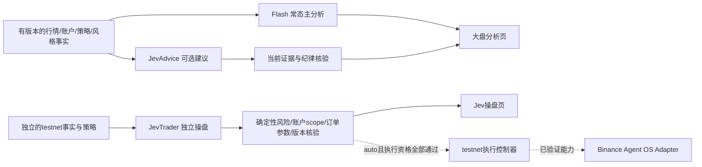

# 两个主页面与三个独立模块

修订：2026-10-06，Asia/Shanghai。依据用户最后两次澄清；覆盖旧“全局建议/自动模式＋一个Jev开关”的中间实现。

| 主页面 | 模块 | 开关与职责 |
| --- | --- | --- |
| `/overview` 大盘与分析 | Flash | 常态主分析：行情、特征、持仓、分析/建议/解释。Jev启停不改变此路径 |
| 同页 | JevAdvice | 可选独立建议；直接使用有效事实与策略标准，不等待本轮Flash；本模块没有资金写Port |
| `/jev-trader` Jev操盘 | JevTrader | 独立操盘开关、自己的建议/自动执行方式与testnet配置；不依赖JevAdvice开启 |

会话风格、记录、复盘与系统保留为辅助入口。旧`/agent`只作为大盘页别名，不再是第三个主页面。

两条Jev路径可用同一个模型ID和HTTP Adapter类，但请求、开关版本、单在途锁、触发器和结果归属分别拥有。它们不互相await，也不把本轮Flash文字作为前置输入。关闭JevAdvice不关闭JevTrader；关闭JevTrader不关闭JevAdvice。各自启停作废本模块旧结果，不增加另一模块的配置版本。

三模块共用预算账本/全局小时调用额度/风格/硬资金纪律；每次请求均先预留并结算，关闭后不抹去已产生费用。无策略、有效证据或限额时拒绝模型/执行，不将缺失状态写成HOLD或余额零。强模型只保存选择、不调用。

## 当前已实现与缺口

当前已实现三模块配置与独立版本、两主页面及受保护的独立保存接口。设置用SQLite CAS与STATE_CHANGED审计同事务保存，重启恢复；旧设置没有trader字段时默认关闭操盘，不能把原Jev建议选择变成执行权限。操盘方式仅控制JevTrader，Flash保持continuous。

**尚未装配收费Flash/Jev后台、Jev独立触发/结果发布、实际Agent OS读取或testnet执行器。** 当前paid=false、writes_enabled=false，页面显示未连接/未就绪，保存自动设置不会开始下单。大盘保留既有只读行情/持仓/图表；模型缺失时不会虚构分析。

当前装配只有一个可选production只读来源；在独立testnet事实源完成前，auto配置仍拒绝混用production读取开关。这是暂时的数据隔离门，后续三lane装配应让Flash读取自己的来源、JevTrader读取独立testnet来源，不能将生产主账户持仓用于testnet卖单。

## Jev与Agent OS边界

[TypeSafe System One](https://docs.typesafe.ai/concepts/system-one)描述Jev的typed判断/概率；程序拥有候选空间、参数生成与确定性检查，不把confidence当胜率。[OpenRouter Decisions接口](https://openrouter.ai/docs/api/api-reference/alphadecisions/submit-a-decisions-request)提供state/questions，当前没有将MCP工具交由模型自由调用的契约。

[Binance MCP文档](https://developers.binance.com/en/docs/agent-native/mcp-server/agentic)要求非读操作确认，交易使用Agentic子账户；当前未验证无人确认或testnet工具映射。用户已授权自动testnet开发，但不能绕过服务确认协议或把主账户只读视图冒充子账户库存。Direct Testnet若作为联调Adapter，应标明provider，不能称Agent OS已接通。

执行器必须先完成持久intent/clientOrderId/原子claim、UNKNOWN_SUBMIT查询对账而非盲重发、过滤器/资金与亏损上限、当前module/style/strategy/account身份重验、停机和恢复。[Spot Testnet](https://developers.binance.com/en/docs/products/spot/testnet/general-info)为独立虚拟资金环境，并可能重置；不能将testnet结果声称为真实盈亏。

后续顺序：JI2细化三lane后台与独立事实scope；完善判断/订单/费用/延迟展示；JI4验证Agent OS映射；JI5持久执行控制器/Fake故障回归，再在凭据与限额就绪后实际testnet联调。依赖仍由用户管理，无收费调用或真实资金自动执行。
