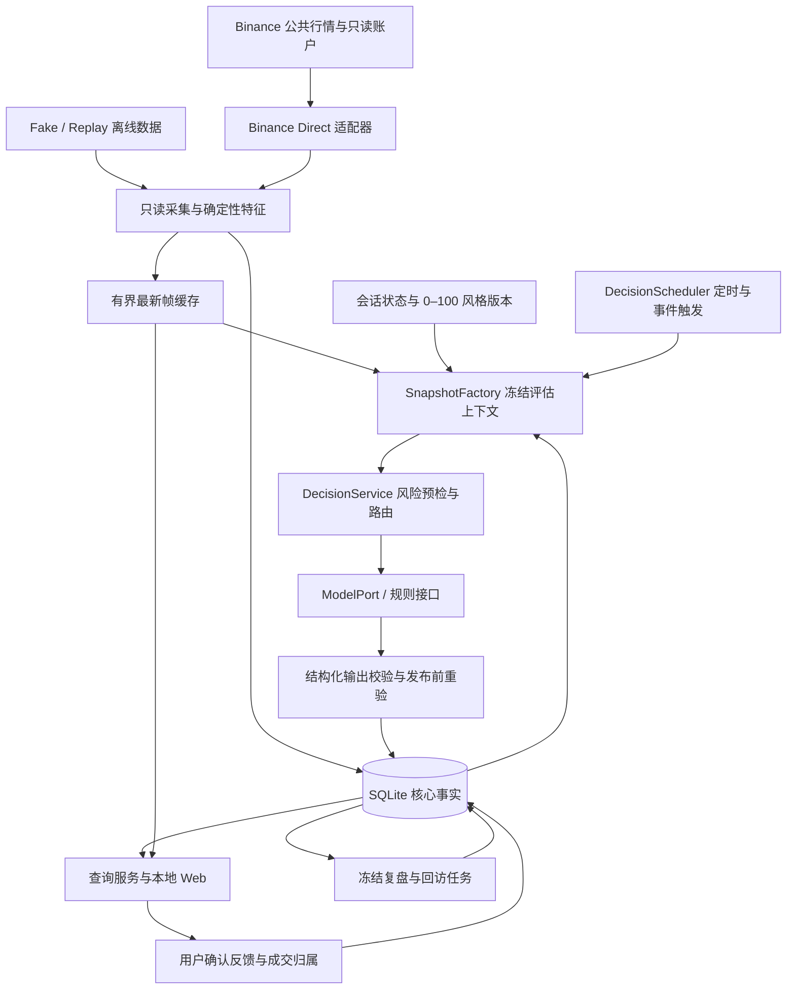

# 当前项目、框架与 Condor 来源说明

2026-10-08当前交付：公共行情引用中立futures_values；trading_execution领域/Ports、PaperFuturesBackend、SQLiteExecutionJournal和TradeExecutionService构成通用执行基础。新模块独立实现并复用本项目模拟引擎/SQLite，不是Condor直接拷贝。全量1450/154，验收 [TRADING_EXECUTION_VERIFICATION.md](TRADING_EXECUTION_VERIFICATION.md)。持续操盘尚未装配；下段“未重构”为此前状态。

2026-10-08架构修订：建设共用USDT合约操盘主体，独立替换行情与执行/账户后端；Paper作为模拟后端保留，后续Testnet复用主体。当前接口仍有Paper绑定，本轮仅修订设计，不代表重构已经完成。见 [通用交易架构](TRADING_CORE_ARCHITECTURE.md)。

2026-10-07验证基线：USDT合约Paper离线内核/SQLite与公共运行行情数据层已验收，新增模块独立实现，复用本项目既有公共HTTP传输及领域值契约。最新全套1372项/150subtests；真实ETH/SOL public mark/book/filters/结算成功。尚未装配合约JEV操盘后台和Web；Flash常态、可选建议、合约只读账户、Testnet/Agent OS和24h仍有缺口。[当前剩余任务](REMAINING_WORK.md)，[行情验证](FUTURES_MARKET_VERIFICATION.md)。下文文件数量/Condor代码比对保留原日期，不能当作新模块的重新审计。

最终产品结构以JEV_PARALLEL_PRODUCT.md为准：大盘页含Flash常态分析和可选Jev建议，另一页为独立Jev操盘。建议与操盘分别开关/版本，Flash不受其支配；后文旧单开关为中间实现记录。

2026-10-06新增：Jev独立模块与建议/自动操盘两模式。JI1开关/模式配置与预算门控、JI3A持久设置及`/agent`页面已实现；Flash/Jev不计划默认串行。独立持仓后台、Agent OS工具读取/执行和testnet自动下单仍未完成。旧Condor比对文件数量与历史验收均保留原日期和范围，不能当作新增代码审计。详见JEV_INDEPENDENT_MODULE.md。

整理日期：2026-10-05；模型配置状态补充于2026-10-06，Asia/Shanghai。本文描述已经存在的实现，不把规划接口当作已经接通的能力。

开发根目录：`D:/develop/tradingagent/Blockchain-Trading-Lab/tradingagent`。
Condor 参考目录：`D:/develop/tradingagent/condor-main`，只读，独立于本项目。
Python 包名为 `agent_platform`，发行包名为 `btc-agent-platform`，当前版本 `0.1.0`。

## 1. 先回答：到底复用了什么？

**当前没有发现直接搬入的 Condor 模块；采用的是参考 Condor 设计后独立实现的方式。**
这也意味着，现在的程序并不是运行在 Condor、Hummingbot 或 Condor 的 ACP Agent 框架上。
如果将“代码复用”严格理解为直接复制、导入或包装调用上游代码，目前没有可列出的已复用模块。
会话、决策循环、风险与日志这些模块可以列为设计参考，不能称为已抽离的 Condor 原代码。

本次实际比较了当前产品目录的 145 个 Python 文件、3 个 CSS、7 个 JavaScript、7 个 HTML，
以及 Condor 参考目录排除测试、依赖和构建产物后的 367 个 Python 文件和 5 个前端文件：

- 非空文件 SHA256 完全相同项：0。
- 去掉文档字符串、保留标识符的函数 AST 相同项：0；门槛为至少 8 行、50 个 AST 节点，共比较本项目 363 个与参考项目 3021 个函数。
- 当前产品源码中的 Condor/Hummingbot 静态及字面量动态导入：0。
- 两侧 Python 解析错误：0；依赖清单也没有 Condor/Hummingbot。

这是有范围的比对，不能证明任意改名、改写的片段或短小通用函数绝无相似；相似也不能单独证明复制。
结合实际模块实现、依赖清单和抽离记录，当前分类应为“设计参考与独立实现”。
可复查的[审计结果](D:/develop/tradingagent/Blockchain-Trading-Lab/tradingagent/output/verification/condor-reuse-audit-20261005.json)记录了两侧文件清单、哈希与比对门槛；
[审计脚本](D:/develop/tradingagent/Blockchain-Trading-Lab/tradingagent/output/verification/condor-reuse-audit-20261005.py)只读取源代码，不导入或执行 Condor。

## 2. Condor 与当前实现的对应关系

下表的对应表示功能与设计参考，不表示类、算法或数据模型相同。

| Condor 参考位置 | 当前项目对应位置 | 当前处理方式 |
| --- | --- | --- |
| [runtime/sessions.py](D:/develop/tradingagent/condor-main/condor/runtime/sessions.py) | [会话领域](D:/develop/tradingagent/Blockchain-Trading-Lab/tradingagent/agent_platform/domain/sessions.py)、[会话服务](D:/develop/tradingagent/Blockchain-Trading-Lab/tradingagent/agent_platform/application/sessions.py) | 参考生命周期和状态归属；重新实现持久会话、单活跃会话、并发版本检查、风格版本。Condor 的会话是聊天 Agent 子进程，本项目的是交易辅助业务会话。 |
| [agents/engine.py](D:/develop/tradingagent/condor-main/condor/agents/engine.py) | [DecisionRuntime](D:/develop/tradingagent/Blockchain-Trading-Lab/tradingagent/agent_platform/runtime/decisions.py)、[DecisionService](D:/develop/tradingagent/Blockchain-Trading-Lab/tradingagent/agent_platform/application/decisions.py) | 参考 gather → decide → persist；拆成事实快照、调度、风险预检、模型/规则评估、发布前重验与原子持久化。未迁移 ACP 子进程和交易工具调用。 |
| [agents/risk.py](D:/develop/tradingagent/condor-main/condor/agents/risk.py) | [RiskService](D:/develop/tradingagent/Blockchain-Trading-Lab/tradingagent/agent_platform/application/risk.py) | 参考“硬纪律由程序执行”；按 BTC 现货、Decimal、余额、时效、数量与过滤器证据重新实现。Condor 的 Bot/Executor、DEX、杠杆权限检查没有搬入。 |
| [runtime/loops.py](D:/develop/tradingagent/condor-main/condor/runtime/loops.py) | [RuntimeSupervisor](D:/develop/tradingagent/Blockchain-Trading-Lab/tradingagent/agent_platform/runtime/supervisor.py)、[DecisionScheduler](D:/develop/tradingagent/Blockchain-Trading-Lab/tradingagent/agent_platform/runtime/scheduler.py) | 参考统一拥有运行生命周期；自行管理异步 worker 启停、失败清理、健康和决策单在途。持久事实恢复使用本项目 SQLite。 |
| [agents/journal.py](D:/develop/tradingagent/condor-main/condor/agents/journal.py)、[runtime/conversations.py](D:/develop/tradingagent/condor-main/condor/runtime/conversations.py) | [SQLite 事件存储](D:/develop/tradingagent/Blockchain-Trading-Lab/tradingagent/agent_platform/adapters/sqlite/events.py)、[复盘服务](D:/develop/tradingagent/Blockchain-Trading-Lab/tradingagent/agent_platform/application/reviews.py) | 参考事实持久化与保留历史；改为类型化事件、原始建议、成交归属与冻结复盘版本。没有迁移 Condor 的聊天 transcript、Markdown journal 或跨会话 learnings。 |
| [runtime/confirmations.py](D:/develop/tradingagent/condor-main/condor/runtime/confirmations.py) | [Web 本地保护](D:/develop/tradingagent/Blockchain-Trading-Lab/tradingagent/agent_platform/web/security.py)、[反馈服务](D:/develop/tradingagent/Blockchain-Trading-Lab/tradingagent/agent_platform/application/feedback.py) | 参考显式确认思想；实现风格/反馈/归属/复盘的本地确认与版本检查。它不等同于 Condor 交易工具的权限确认注册表。 |
| [server_data_service.py](D:/develop/tradingagent/condor-main/condor/server_data_service.py)、fetchers | [LatestOverview](D:/develop/tradingagent/Blockchain-Trading-Lab/tradingagent/agent_platform/runtime/latest.py)、[Binance Direct](D:/develop/tradingagent/Blockchain-Trading-Lab/tradingagent/agent_platform/adapters/binance_direct/account.py) | 参考缓存和订阅边界；以固定只读接入、规范化事件、有界窗口和最新帧重新实现。未复制 Hummingbot 客户端或上游字典模型。 |
| ConfigManager、Hummingbot MCP、Telegram、Bot/Controller/Executor、Condor 前端 | 自有装配、Binance 适配器、本地 Web | 未纳入当前项目依赖与运行体系。 |

0–100 风格、交易想法与真实执行的归属、冻结复盘、费用预留与 UNKNOWN 状态、辅助行情保留、
Fake/Replay 和本地工作台，是按照本项目需求建立的实现。它们不能仅凭功能相似就归为 Condor 源码复用。

Condor 本地 LICENSE 为 MIT，版权行是 `Copyright (c) 2023 Hummingbot Foundation`。
若以后确实复制其代码，应逐文件记录来源、修改与许可证说明；当前审计没有发现需要登记的直接复制模块。
原始抽离边界及本次补充见[来源盘点](D:/develop/tradingagent/Blockchain-Trading-Lab/tradingagent/docs/CONDOR_EXTRACTION.md)。

## 3. 项目结构与职责

下面的树相对于上面的开发根目录；只列主要职责，不列每个文件。

```text
tradingagent/
├─ agent_platform/                 唯一产品 Python 包
│  ├─ domain/                     金额、行情、账户、会话、建议、风险、费用、复盘等类型
│  ├─ ports/                      接口契约：输入输出是什么、调用方可依赖什么
│  ├─ application/                业务流程：同步、评估、反馈、归属、复盘、查询
│  ├─ runtime/                    asyncio 后台任务、缓存、调度、启停和健康
│  ├─ adapters/
│  │  ├─ binance_direct/          公共 REST/WS、只读账户、成交、私流提示
│  │  ├─ binance_agent_os/        可选 MCP 工具清单和 Schema 探测
│  │  ├─ sqlite/                  核心事实、状态、预算、复盘、备份与辅助行情库
│  │  ├─ openrouter/              有界HTTP、Flash Chat及Jev Decisions Adapter
│  │  ├─ fake/                    可控时钟、市场、账户、模型
│  │  ├─ rules/                   离线验证用的明确规则
│  │  ├─ paper/                   独立纸面模拟器
│  │  └─ operational_log.py       脱敏、有限容量的运行日志
│  ├─ replay/                     录制 JSONL 的流式读取、回放和报告
│  ├─ web/                        FastAPI 页面与 API、Jinja2、原生 JS/CSS
│  ├─ bootstrap.py                创建具体实现并注入业务服务，拥有资源清理
│  ├─ config.py                   严格的运行开关和保留策略
│  └─ cli.py                      本机启动、诊断、回放、备份、短测与验收入口
├─ tests/                         分层单元、适配器、集成、离线和 Web 验证
├─ docs/                          规格、计划、契约、运行手册、状态和验收边界
├─ data/                          默认运行数据位置，首次运行时按需创建
├─ output/verification/           开发验证日志、截图、合成库、wheel 和审计证据
├─ pyproject.toml                 构建、依赖、CLI、测试与代码检查配置
├─ environment.yml                Conda 环境说明
├─ requirements.lock.txt          当前本机 29 个包的版本快照
└─ DEVELOPMENT_PLAN.md            总开发计划
```

`output/verification` 是证据和隔离测试产物，不能作为生产模块，也不能将里面的 Fake 成交视为真实账户。
外层的 Condor 和其他参考项目没有参与 `agent_platform` 的包发现或产品运行。

内核采用 Ports & Adapters 分层：领域对象不认识交易所、HTTP 或数据库；业务服务依赖接口；
具体适配器实现接口；`bootstrap.py` 选择并装配实现。这里的 Port 指 Python 接口，不是网络端口。

依赖方向：`domain` 只依赖标准库/Pydantic/自身；`ports` 可以依赖领域；
`application` 可以依赖领域与 Ports；具体网络/SQLite 实现位于 adapters。
[架构检查](D:/develop/tradingagent/Blockchain-Trading-Lab/tradingagent/tests/architecture/test_dependency_boundaries.py)约束内核不导入 Condor、Hummingbot、MCP、网络客户端和 SQLite。

## 4. 一次运行如何工作



这是业务数据流图；`bootstrap.py` 和 `RuntimeSupervisor` 负责把这些模块启动和停止。

1. CLI 启动 FastAPI；lifespan 进入 `build_application_services`，初始化 SQLite、时钟、缓存、服务与 worker。
2. 显式启用公共行情后，REST/WS 适配器把原始响应转为自有领域对象；高频采集与确定性指标独立于模型。
3. 只读账户通常每 15 秒同步，原子保存余额、订单、成交与导入游标；私流只是请求 REST 对账的提示。
4. 用户明确确认风格后建立会话，再选择启动评估；数值及版本进入每次快照。
5. 决策调度默认无持仓 300 秒、有持仓 60 秒，事件另有去抖；保持一个决策在途。
6. 决策服务冻结事实、先做风险预检；模型分支先持久预留费用，再调用 ModelPort，校验结构化结果与用量。
7. 发布前重新检查当前风格、会话、账户与证据时效；旧结果保留审计，但不能继续显示为当前行动。
8. Web 读取缓存和查询投影，SSE 推送最新帧；用户本地确认反馈与归属后，复盘冻结相关事实并追加版本。

默认启动的四个后台组件为只读运行、决策运行、复盘任务与诊断。
启用公共行情且允许归档时增加行情归档；启用私流时增加账户提示消费者。
当前装配没有传入真实模型或规则，路由表为空、日费用预算为 0；因此启动页面不意味着自动产生有效交易建议。

## 5. 实际使用的技术框架

| 部分 | 当前技术 | 作用 |
| --- | --- | --- |
| 运行环境 | Conda，Python 3.12；正式解释器 `C:/Users/exile/anaconda3/envs/tradingagent/python.exe` | 用户管理依赖与环境 |
| 数据契约 | Pydantic 2、标准库 Decimal、带时区 UTC | 校验严格类型，避免金额经过 float；API 用十进制字符串 |
| 后台并发 | Python asyncio，自有 RuntimeSupervisor/Scheduler | 采集、评估、回访、清理和取消生命周期 |
| Web 后端 | FastAPI、Uvicorn、Jinja2 | 单用户本地工作台、受保护的本地 API、SSE |
| 前端 | 原生 JavaScript/CSS、SVG 图表 | 会话滑杆、行情、记录、复盘和系统状态；当前无需 Node 构建 |
| 外部只读接入 | httpx、websockets，自有 Binance 协议适配器 | 固定 REST 读取、行情与可选私流 |
| 业务存储 | 标准库 SQLite、WAL、schema v7 | 会话、事实、版本、事件、建议、预算、归属和复盘 |
| 模型边界 | ModelPort、DecisionModelPort、OpenRouter/Fake Adapters | Flash生成式/Jev类型化接口已离线验证；持久预算、完整取消结算，强模型可选择但不可调用 |
| Agent OS 边界 | 自有 ToolInventorySession 协议与 McpCapabilityProbe | 只探测工具清单和 Schema；未接真实 SDK、授权与工具映射 |
| 质量工具 | pytest、pytest-asyncio、Ruff，setuptools wheel | 离线验证、边界检查、格式与打包 |

这个 Agent 的编排框架是本项目自己的应用服务与异步运行层。
Condor 的 ACP/PydanticAIClient、聊天子进程、Telegram 和 Hummingbot 均不是当前技术栈。
Binance Agent OS 是预留的可选外部能力提供者；现在的主数据链路是 Binance Direct。

## 6. 数据和“记忆”放在哪里

| 数据 | 位置与语义 |
| --- | --- |
| 核心事实 | 默认 `D:/develop/tradingagent/Blockchain-Trading-Lab/tradingagent/data/agent.sqlite3`；会话、风格历史、真实读取事实、建议、事件、费用、反馈、归属、复盘与回访 |
| 辅助行情 | 同目录 `agent.market.sqlite3`；公共行情启用归档后创建，原始/分钟数据默认保留 7/90 天，各可设 1–365 天，pin 保留 |
| 运行日志 | 同目录 `agent.operations.jsonl`；脱敏健康诊断，轮转 1 MiB + 3 份，不代替业务审计 |
| 开发预览 | `D:/develop/tradingagent/Blockchain-Trading-Lab/tradingagent/output/verification/browser-preview.sqlite3`；独立测试库 |
| 凭据 | 仅由本机进程环境读取，不写入上述数据库，也不传给浏览器 |

`--database` 可改变核心库路径，辅助库与日志按该路径派生。
当前“记忆”是结构化事实和版本历史：系统知道某次建议用了哪个风格、用户如何反馈、哪些成交被明确关联、复盘依据什么。
它尚不是完整聊天助手记忆、向量检索或自动学习并更新策略的系统。
风格原值与版本会保留；风格不会改变硬风险限制，也不代表资金百分比。

## 7. 已实现范围与真实接通状态

| 能力 | 当前状态 |
| --- | --- |
| 会话/风格、本地工作台、事实存储、反馈归属、冻结复盘与回访 | 已实现，离线与本机界面有验证证据 |
| 公共 REST/WS、账户只读、可选私流提示 | 适配器与离线异常链路已实现；REST 时间曾成功读取，真实 WS/账户/权限联调仍未通过完整验收 |
| 风险/调度/模型路由/费用预算/发布校验 | 核心已实现并离线验证；真实个人纪律、策略、模型端点和价格配置待明确 |
| 真实模型调用 | Flash/Jev HTTP Adapter与Jev预算执行器已实现；默认启动不装配，生产provider/价格/预算及发布级联待做，未调用收费接口 |
| Binance Agent OS | 当前为可选工具清单探测与 Schema 指纹；真实授权、scope、只读工具映射待实施/验证 |
| Replay / paper | 离线验证能力；paper 是独立模拟器，不是接入真实资金的执行器，也未作为自动交易入口装配 |
| JEV | 独立Port、Choice/Score/Noul、Decisions Adapter与预算执行器已离线验证；Prompt v2为not_connected，v1历史重放保留原义，真实连接/语义评测待做 |
| 成本与盈亏 | FIFO 与证据冻结已实现；完整库存/移动/FX 不足时继续 UNKNOWN/PARTIAL，不能把 USDT 当 USD |
| 连续运行 | 启停、重启恢复、备份、保留和短测已验证；真实 24 小时尚未经过 |

截至最近验收记录，T01–T16 约定的离线范围完成，真实首版仍未验收。
2026-10-06新增模型主体F1–F4后，最新完整1056项与134个subtest通过（223.67s），Ruff/280文件format及新wheel隔离检查通过。Flash/Jev Adapter已实现但尚未装配完整发布级联，强模型只能选择、固定禁用。
完整证据与具体缺口以[验收报告](D:/develop/tradingagent/Blockchain-Trading-Lab/tradingagent/docs/ACCEPTANCE_REPORT.md)为准，
最新状态见[开发状态](D:/develop/tradingagent/Blockchain-Trading-Lab/tradingagent/docs/DEVELOPMENT_STATUS.md)。

## 8. 建议怎样读代码、怎样接续开发

阅读入口依次为：

1. [bootstrap.py](D:/develop/tradingagent/Blockchain-Trading-Lab/tradingagent/agent_platform/bootstrap.py)：看实际装配了什么，避免把一个接口当成已接通能力。
2. [domain/sessions.py](D:/develop/tradingagent/Blockchain-Trading-Lab/tradingagent/agent_platform/domain/sessions.py)：看会话、风格、状态与版本。
3. [ports/model.py](D:/develop/tradingagent/Blockchain-Trading-Lab/tradingagent/agent_platform/ports/model.py)及 Ports 目录：看替换外部提供者需要遵守的契约。
4. [application/decisions.py](D:/develop/tradingagent/Blockchain-Trading-Lab/tradingagent/agent_platform/application/decisions.py)和 RiskService：看一次评估怎样预检、收费预留、校验与发布。
5. [runtime/decisions.py](D:/develop/tradingagent/Blockchain-Trading-Lab/tradingagent/agent_platform/runtime/decisions.py)：看后台触发、时效、单在途与取消。
6. [adapters/binance_direct/read_client.py](D:/develop/tradingagent/Blockchain-Trading-Lab/tradingagent/agent_platform/adapters/binance_direct/read_client.py)：看只读外部调用边界。
7. [web/app.py](D:/develop/tradingagent/Blockchain-Trading-Lab/tradingagent/agent_platform/web/app.py)：看用户入口与页面/API。

接续优先围绕真实可用闭环：明确策略与个人纪律的配置入口，完成模型供应商适配器与装配，验证公共 WS 和只读账户；
随后验证实际 24 小时运行。可选 Agent OS 接入按相同领域/Ports 契约替换提供者，不接管本项目会话、记忆和决策循环。
这些属于后续配置、开发或联调，不能仅提供 API Key 就视为全部完成。

本次只增加项目说明与来源审计，没有移动源码、修改用户 README 或改变运行行为。
