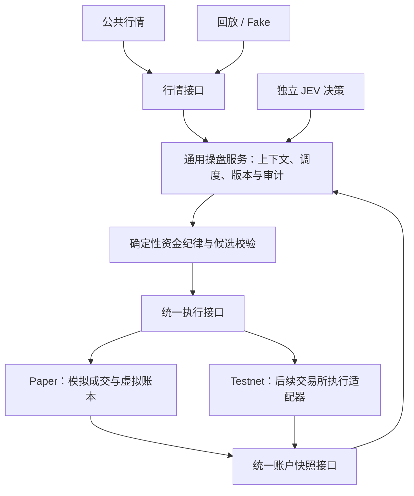

# 通用交易主体与可替换执行后端

2026-10-08。用户提出：应开发通用交易模块，通过替换接入实现模拟交易和后续交易所执行。本文件修订接下来的架构方向；当前中立事实/Ports、Paper后端和通用持久执行通道已实现，验收 [TRADING_EXECUTION_VERIFICATION.md](TRADING_EXECUTION_VERIFICATION.md)；持续后台、共用JEV风控和Web仍未装配。此前合约模拟计算与公共行情验证继续有效。

## 目标与范围

独立 JEV 操盘使用同一套决策、纪律、订单编排、审计和运行控制。先接本地 Paper 后端跑通，再接经过能力核对的 Binance USDT 永续 Testnet 后端及 Agent OS 通道。Flash 常态分析与可选 JEV 建议仍各自独立，不进入操盘的必经路径。真实资金执行不属于已授权实现或启动范围。

通用范围首先是用户需要的 USDT 永续；现货的余额、买卖和持仓含义不同，保留旧接口及历史事实，不为统一命名而套用合约计算。

## 两个独立的替换边界

| 边界 | 可选实现 | 职责 |
| --- | --- | --- |
| 行情输入 | Binance 公共行情、录制回放、Fake | 提供有来源、市场、币种、时间和质量的行情事实 |
| 执行与账户 | 本地 Paper、后续 Testnet | 提交或模拟订单，提供订单/成交/账户事实及恢复查询 |

Paper 可以使用真实 Binance 行情，也可以使用回放；换成模拟行情只改变价格输入，并不会自动生成虚拟订单、保证金、手续费、资金费或持仓。因此模拟执行后端仍然必要，但应作为主体框架的一个实现。

输入和执行配置分开不意味着任意组合都可启动：市场、合约、来源、账户命名空间、时钟与目标网络必须相容；Testnet 工具和接口能力仍待核对。回放使用受控事件时钟，不能静默套用墙上时钟。当前收费 JEV 仍要求真实公共行情及有效费用授权，Fake/回放默认使用离线模型。

## 分层与数据流

Domain 定义不可变交易意图、执行回执、订单状态、成交与账户快照。Application 编排模型、纪律、持久命令和后台；只依赖 Domain/Ports。Ports 定义行情、执行和账户读取契约；具体 Binance/MCP/SQLite 类型留在 Adapter。运行装配选择具体后端。

### 主体共用的行为

- 选定合约、历史与实时上下文、0–100 风格及版本、独立 JEV 调度、模型费用预留与结算。
- 开多、开空、减仓或等待候选；对目标名义仓位、运行损失、数量、交易规则、新鲜度及会话/账户/操盘版本做确定性检查。
- 在途结果过期、暂停、配置变化或账户变化后，拒绝增加风险；执行前重取当前事实。
- 持久订单意图和幂等标识、订单生命周期、执行回执审计、异常暂停、恢复查询及对账。暂停新增风险后继续必要的行情与账户维护。
- 页面使用同一操盘状态视图，明确显示执行后端及事实来源；旧 Spot、Paper、Testnet 账户相互隔离。

通用账户视图用于读取，不意味着通用服务可以直接修改所有账户余额。资金修改必须经过选定后端的执行或维护路径。

### 后端负责的行为

| Paper 后端 | Testnet 后端（尚未实现） |
| --- | --- |
| 根据真实或回放盘口模拟成交、滑点和手续费 | 通过核对后的接口提交测试网订单并读取实际回执 |
| 原子更新虚拟钱包、逐仓保证金和持仓 | 以交易所账户、订单和成交事实为资金依据 |
| 重放已结算资金费，维护模拟清算与固定模拟规则 | 读取交易所资金费、风险和清算结果，不运行本地模拟账本覆盖它们 |
| 使用已验收的 SQLite CAS、幂等和恢复纪律 | 查询/同步订单及账户，处理超时、部分成交和不确定结果 |

公共风险纪律共用，保证金和清算依据按后端处理。本地固定模拟维持率不能成为交易所真实风控档位。

## 执行契约与失败语义

执行接口接受经过纪律检查的交易命令并返回回执，不能把“提交成功”统一当作“全部成交”。共用订单状态应能区分待提交、已接受、部分成交、全部成交、拒绝、取消和结果未知；实际成交数量、均价及手续费来源明确。第一阶段只实现已需要的市价开仓与 reduce-only 减仓，其他订单类型后续按需求扩展。

提交前持久化命令标识和输入。相同标识与不同内容冲突；网络超时后进入结果未知并暂停冲突命令，通过查询/对账恢复，不盲目重新提交。后端提供按命令/订单查询和账户同步能力。Paper 可以在一个本地事务中立即产生确定回执；主体流程仍须用 Fake 后端验证延迟、部分成交、未知和重复回执，不能依赖立即成交。

恢复应保留命令、费用、账户来源及未完成状态，并默认暂停新增风险，不能重置虚拟本金或自动切到另一个账户。测试网权限与工具能力检查是后端启用条件，不因统一接口存在而获得授权。

## 现有代码的处理

- `domain/futures_paper_engine.py` 及其模拟状态/SQLite 实现保留，归入 Paper 后端内部；多空、逐仓、资金费和清算工作不作废。
- `ports/futures_paper.py` 是当前模拟存储契约，不能直接宣称它已经是通用执行接口。增加独立的通用执行和合约账户快照 Ports，由 Paper Adapter 转换并调用它。
- `domain/futures_market.py` 当前仍引用 `FuturesPaperQuote`。后续抽取市场通用报价/命令事实并保留兼容入口，公共 Provider 不再以 Paper 类型作为上层边界；逐项验证，不进行批量改名。
- 旧 `application/paper_trading.py` 是已验收的 Spot/BTC 专属应用层，保留历史运行；新的 USDT 合约主体不复制另一份 Paper 专属决策循环。
- 公共合约 Provider 保留其独立客户端、新鲜度、资金费窗口与规则校验。模拟后端维护迟到资金费与同刻排序；交易所后端通过自身账户/订单事实恢复。

## 后续交付顺序与验收

1. 定义市场通用事实、交易命令/回执、执行及合约账户 Ports；保留已有接口兼容，明确能力与环境身份。
2. 实现 Paper Backend 包装，复用已有模拟内核/SQLite；建立通用运行服务与独立维护任务，处理资金费游标、迟到/同刻结算、进程锁和恢复。
3. 实现独立 JEV 决策、费用门控、执行前重验和合约页面，先完成离线完整循环，再按新费用有效期进行有界真实公共行情 Paper 联调。
4. 核对 Testnet/Agent OS 能力，接入测试网账户/订单/成交后端；复用主体，不另写一套 JEV 循环。真实资金后端和启动另行定义范围。

新代码按测试先行推进。验收应证明：同一应用服务切换 Fake/Paper 执行后端，无 Paper 专属类型泄入通用端口；市场与账户不混源；不同订单生命周期、超时未知、重复和恢复不导致重复执行；模拟计算专项继续通过。后续 Testnet 还需要真实测试网合同测试与对账证据，不能用 Mock 或本地模拟结果替代。

通用执行基础最终1450 passed / 154 subtests；此计数不代表完整持续操盘已装配。未修改用户数据库/服务，无收费或交易所订单调用。后续范围以REMAINING_WORK.md为准。
